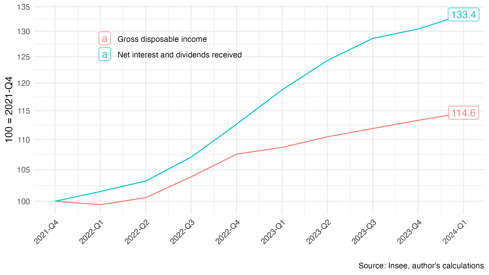

# The Inflation Tax, Purchasing Power, the Savings Rate, and the Public Deficit

## Replication

The repository contains everything needed to replicate the figures and data from the [linked note](https://fgeerolf.com/taxe-inflationniste.html):

### Figure 1: Growth of net interest and dividends received, and of gross disposable income (2021Q4–)

[R Code](figure1.R)

### Figure 2: Interest burden vs. real interest burden (% of GDP)

[R Code](figure2.R)

### Figure 3: Public deficit and public deficit adjusted for the “inflation tax” (% of GDP)

[R Code](figure3.R)

### Table 1: In 2023, a decrease in the Debt/GDP ratio despite a deficit of 5.5% of GDP

[R Code](table1.R)

